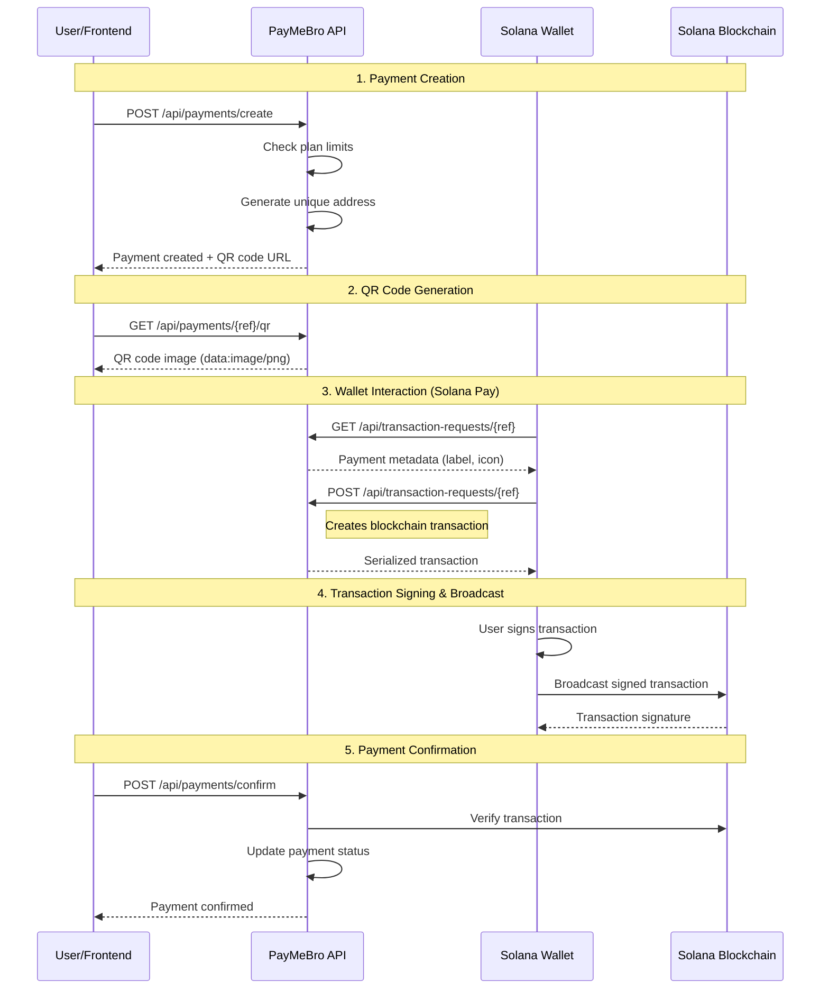

# PayMeBro API Documentation

## Base URL
```
http://localhost:3000/api
```

## 🏗️ Architecture Overview

PayMeBro implements a **dual-layer API architecture** that separates business logic from protocol implementation:

### **Business Layer** (`/api/payments`, `/api/users`, `/api/analytics`, etc.)
- User authentication and authorization
- Plan enforcement and billing
- Analytics and reporting
- Email notifications
- Template management

### **Protocol Layer** (`/api/transaction-requests`)
- Official Solana Pay specification compliance
- Wallet compatibility (Phantom, Solflare, etc.)
- Blockchain transaction creation
- No authentication required (public endpoints)

This separation ensures **standards compliance** while maintaining **business flexibility**.

## Authentication
- Most endpoints require `x-user-id` header with Web3Auth user ID
- Some endpoints use `authenticateUser` middleware for enhanced security
- Transaction request endpoints are public (Solana Pay standard)

---

## 🔥 Payments API (`/api/payments`)

### Create Payment
```http
POST /api/payments/create
Content-Type: application/json
x-user-id: <web3auth_user_id>

{
  "amount": 1.0,
  "label": "Coffee Purchase",
  "message": "Thank you!",
  "memo": "Payment memo",
  "customerEmail": "customer@example.com",
  "web3AuthUserId": "<web3auth_user_id>",
  "chain": "solana",
  "splToken": "Gh9ZwEmdLJ8DscKNTkTqPbNwLNNBjuSzaG9Vp2KGtKJr",
  "merchantWallet": "<optional_custom_merchant_address>"
}
```

**Features:**
- **Plan Enforcement**: Automatic payment limit checking based on user plan
- **Address Generation**: Unique Solana addresses for each payment
- **Fee Calculation**: Automatic fee calculation (2.9% + fixed fee)
- **Email Notifications**: Optional customer email notifications

**Response:**
```json
{
  "success": true,
  "reference": "SolanaAddress123...",
  "url": "solana:http://localhost:3000/api/transaction-requests/SolanaAddress123...",
  "paymentUrl": "http://localhost:3000/payment/SolanaAddress123...",
  "payment": {
    "id": "uuid",
    "amount": "1.0",
    "fee_amount": "0.032",
    "total_amount_paid": "1.032",
    "currency": "SOL",
    "status": "pending"
  }
}
```

### Get Payment Details
```http
GET /api/payments/{reference}
```

### Get Payment Status
```http
GET /api/payments/{reference}/status
```

### Generate QR Code
```http
GET /api/payments/{reference}/qr
```

**Response:**
```json
{
  "success": true,
  "qrCode": "data:image/png;base64,..."
}
```

### Send Invoice Email
```http
POST /api/payments/{reference}/invoice
Content-Type: application/json

{
  "email": "customer@example.com"
}
```

### Confirm Payment
```http
POST /api/payments/confirm
Content-Type: application/json

{
  "signature": "<transaction_signature>",
  "reference": "<payment_reference>"
}
```

**Purpose**: Confirms a payment with blockchain transaction verification.

### Manual Confirm Payment (Development Only)
```http
POST /api/payments/{reference}/confirm
Content-Type: application/json

{
  "signature": "<optional_signature>"
}
```

**Availability**: Only available when `NODE_ENV !== 'production'`

---

## 📊 Analytics API (`/api/analytics`)

### Get Basic Metrics
```http
GET /api/analytics
x-user-id: <web3auth_user_id>
```

**Response:**
```json
{
  "success": true,
  "metrics": {
    "totalPayments": 5,
    "confirmedPayments": 3,
    "pendingPayments": 2,
    "totalRevenue": 15.50,
    "conversionRate": "60.00",
    "planUsage": {
      "current": 5,
      "limit": 10,
      "percentage": 50
    },
    "planInfo": {
      "currentPlan": "free",
      "monthlyUsage": 5,
      "monthlyLimit": 10,
      "remaining": 5
    }
  }
}
```

### Get Payment History
```http
GET /api/analytics/history?page=1&limit=10
```

### Get Merchant Overview
```http
GET /api/analytics/overview
Authorization: Bearer <token>
```

### Get Payment Analytics
```http
GET /api/analytics/payment/{reference}
Authorization: Bearer <token>
```

### Get Trends
```http
GET /api/analytics/trends?period=7d
Authorization: Bearer <token>
```

---

## 📋 Plans API (`/api/plans`)

### Get Plan Usage
```http
GET /api/plans/usage
x-user-id: <web3auth_user_id>
```

**Response:**
```json
{
  "success": true,
  "usage": {
    "currentPlan": "free",
    "monthlyUsage": 5,
    "monthlyLimit": 10,
    "percentage": 50,
    "canCreatePayment": true,
    "remaining": 5
  }
}
```

### Get Plan Information
```http
GET /api/plans/info
```

**Response:**
```json
{
  "success": true,
  "plans": {
    "free": {
      "name": "Free",
      "monthlyLimit": 10,
      "price": 0,
      "features": ["10 payments/month", "Basic analytics", "Email support"]
    },
    "basic": {
      "name": "Basic",
      "monthlyLimit": 100,
      "price": 29,
      "features": ["100 payments/month", "Advanced analytics", "Priority support"]
    },
    "premium": {
      "name": "Premium",
      "monthlyLimit": 1000,
      "price": 99,
      "features": ["1,000 payments/month", "Custom branding", "API access"]
    },
    "enterprise": {
      "name": "Enterprise",
      "monthlyLimit": "unlimited",
      "price": "custom",
      "features": ["Unlimited payments", "Custom integrations", "Dedicated support"]
    }
  }
}
```

### Upgrade Plan
```http
POST /api/plans/upgrade
Content-Type: application/json
x-user-id: <web3auth_user_id>

{
  "planType": "basic"
}
```

---

## 👤 Users API (`/api/users`)

### Register User
```http
POST /api/users/register
Content-Type: application/json

{
  "web3AuthUserId": "<web3auth_user_id>",
  "email": "user@example.com",
  "solanaAddress": "<solana_wallet_address>",
  "ethereumAddress": "<ethereum_wallet_address>"
}
```

### Get User Profile
```http
GET /api/users/profile/{web3AuthUserId}
```

### Complete Onboarding
```http
POST /api/users/onboarding/complete
Content-Type: application/json

{
  "web3AuthUserId": "<web3auth_user_id>",
  "businessName": "My Business",
  "businessType": "retail",
  "walletAddress": "<solana_wallet_address>"
}
```

### Get Onboarding Status
```http
GET /api/users/onboarding/status/{web3AuthUserId}
```

---

## 🔄 Subscriptions API (`/api/subscriptions`)

### Create Subscription Plan
```http
POST /api/subscriptions/plans
Authorization: Bearer <token>
Content-Type: application/json

{
  "name": "Premium Plan",
  "amount": "9.99",
  "currency": "USDC",
  "interval_type": "monthly",
  "interval_count": 1,
  "description": "Premium features"
}
```

### Get Merchant Plans
```http
GET /api/subscriptions/plans
Authorization: Bearer <token>
```

### Subscribe to Plan
```http
POST /api/subscriptions/subscribe
Content-Type: application/json

{
  "plan_id": "<plan_id>",
  "customer_email": "customer@example.com",
  "wallet_address": "<customer_wallet>"
}
```

### Get Subscription Analytics
```http
GET /api/subscriptions/analytics
Authorization: Bearer <token>
```

### Cancel Subscription
```http
DELETE /api/subscriptions/{subscriptionId}
```

### Process Renewals (Cron)
```http
POST /api/subscriptions/cron/daily
```

---

## 📋 Templates API (`/api/templates`)

### Create Template
```http
POST /api/templates
Content-Type: application/json

{
  "name": "Coffee Template",
  "amount": "5.00",
  "currency": "USDC",
  "label": "Coffee Purchase",
  "message": "Thanks for your order!",
  "web3AuthUserId": "<web3auth_user_id>"
}
```

### Get User Templates
```http
GET /api/templates/user/{web3AuthUserId}
```

### Update Template
```http
PUT /api/templates/{id}
Content-Type: application/json

{
  "name": "Updated Template",
  "amount": "10.00"
}
```

### Delete Template
```http
DELETE /api/templates/{id}
```

### Create Payment from Template
```http
POST /api/templates/{templateId}/create-payment
Content-Type: application/json

{
  "customerEmail": "customer@example.com"
}
```

---

## 🔗 Webhooks API (`/api/webhooks`)

### Register Webhook
```http
POST /api/webhooks
Content-Type: application/json

{
  "url": "https://your-app.com/webhook",
  "events": ["payment.confirmed", "subscription.created"],
  "web3AuthUserId": "<web3auth_user_id>"
}
```

---

## 📧 Emails API (`/api/emails`)

### Get Pending Emails
```http
GET /api/emails/pending
x-user-id: <web3auth_user_id>
```

**Response:**
```json
{
  "success": true,
  "emails": [
    {
      "id": "uuid",
      "type": "payment_created",
      "status": "pending",
      "recipient_email": "customer@example.com",
      "created_at": "2024-01-01T00:00:00Z"
    }
  ]
}
```

### Process Email Queue
```http
POST /api/emails/process
```

### Send Test Email
```http
POST /api/emails/test
Content-Type: application/json

{
  "email": "test@example.com",
  "userId": "<web3auth_user_id>"
}
```

---

## 📢 Notifications API (`/api/notifications`)

### Get User Notifications
```http
GET /api/notifications/user/{userId}
```

### Process Pending Notifications
```http
POST /api/notifications/process
```

### Send Payment Reminder
```http
POST /api/notifications/send-reminder
Content-Type: application/json

{
  "paymentReference": "<payment_reference>",
  "customerEmail": "customer@example.com"
}
```

---

## 🔄 Transaction Requests API (`/api/transaction-requests`)

> **Important**: This API implements the official **Solana Pay Protocol** specification and is separate from the Payments API for good architectural reasons.

### Get Transaction Request (Solana Pay)
```http
GET /api/transaction-requests/{reference}
```

**Purpose**: Returns Solana Pay metadata for wallet applications
**Used by**: Wallet apps to display payment information before transaction creation

**Response:**
```json
{
  "label": "PayMeBro Payment",
  "icon": "https://example.com/icon.png"
}
```

### Create Transaction (Solana Pay)
```http
POST /api/transaction-requests/{reference}
Content-Type: application/json

{
  "account": "<wallet_public_key>"
}
```

**Purpose**: Creates the actual blockchain transaction for wallet signing
**Used by**: Wallet apps to get the serialized transaction

**Response:**
```json
{
  "transaction": "<base64_encoded_transaction>",
  "message": "Payment of 1.0 SOL"
}
```

---

## 🔄 Payments vs Transaction-Requests: Architecture Explanation

### **Why Two Separate APIs?**

#### **`/api/payments` - Business Logic Layer**
- **Purpose**: High-level payment lifecycle management
- **Authentication**: Requires user authentication (`x-user-id`)
- **Features**: Plan enforcement, analytics, notifications, QR codes
- **Rate Limiting**: Business-focused limits (10 payments/min)
- **Audience**: Your application frontend

#### **`/api/transaction-requests` - Protocol Layer**
- **Purpose**: Official Solana Pay protocol implementation
- **Authentication**: No user auth required (public endpoints)
- **Features**: Wallet compatibility, transaction creation
- **Rate Limiting**: Protocol-focused limits (30 requests/min)
- **Audience**: Solana wallets (Phantom, Solflare, etc.)

### **Complete Payment Flow**



### **Step-by-Step Flow**

1. **Payment Creation** (`/api/payments`)
   ```http
   POST /api/payments/create
   → Creates payment record
   → Enforces plan limits
   → Generates unique Solana address
   → Returns payment URL and QR code
   ```

2. **QR Code Display** (`/api/payments`)
   ```http
   GET /api/payments/{reference}/qr
   → Generates QR code image
   → Contains Solana Pay URL pointing to transaction-requests
   ```

3. **Wallet Metadata Request** (`/api/transaction-requests`)
   ```http
   GET /api/transaction-requests/{reference}
   → Wallet scans QR code
   → Requests payment metadata (Solana Pay standard)
   → Returns label and icon for display
   ```

4. **Transaction Creation** (`/api/transaction-requests`)
   ```http
   POST /api/transaction-requests/{reference}
   → Wallet requests transaction
   → Creates serialized Solana transaction
   → Handles SPL tokens, fees, memos
   → Returns transaction for wallet signing
   ```

5. **Payment Confirmation** (`/api/payments`)
   ```http
   POST /api/payments/confirm
   → Verifies blockchain transaction
   → Updates payment status
   → Sends notifications
   → Updates analytics
   ```

### **Key Benefits of This Architecture**

✅ **Standards Compliance**: Full Solana Pay compatibility
✅ **Wallet Support**: Works with all Solana wallets
✅ **Business Logic Separation**: Clean separation of concerns
✅ **Security**: Different auth/rate limiting per use case
✅ **Flexibility**: Can modify business logic without breaking protocol
✅ **Monitoring**: Separate analytics for protocol vs business usage

### **URL Structure Examples**

```bash
# Business Layer (Your App)
https://api.paymebro.com/api/payments/create
https://api.paymebro.com/api/payments/ABC123/qr
https://api.paymebro.com/api/payments/confirm

# Protocol Layer (Solana Pay)
https://api.paymebro.com/api/transaction-requests/ABC123
```

The QR code contains: `solana:https://api.paymebro.com/api/transaction-requests/ABC123`

---

## 🏥 Health Check API

### Health Check
```http
GET /health
```

**Response:**
```json
{
  "timestamp": "2024-01-01T00:00:00.000Z",
  "status": "healthy",
  "version": "1.0.0",
  "uptime": 3600.123,
  "memory": {
    "rss": 123456789,
    "heapTotal": 123456789,
    "heapUsed": 123456789
  },
  "checks": {
    "database": {
      "status": "healthy",
      "responseTime": 50
    }
  }
}
```

### Liveness Check
```http
GET /health/live
```

---

## Plan Limits & User Service Integration

### Plan Types & Limits
- **Free**: 10 payments/month
- **Basic**: 100 payments/month  
- **Premium**: 1,000 payments/month
- **Enterprise**: Unlimited payments

### User Service Features
- **Centralized User Management**: All user-related operations consolidated
- **Plan Enforcement**: Automatic payment limit checking
- **Usage Tracking**: Real-time usage statistics
- **Plan Upgrades**: Seamless plan upgrade functionality

### Address Resolution Service
- **Dynamic Address Resolution**: Hierarchical address resolution system
- **Fallback Mechanisms**: Multiple fallback levels for reliability
- **Solana Address Validation**: Comprehensive address validation
- **Network Detection**: Automatic detection of different blockchain networks

---

## Response Formats

### Success Response
```json
{
  "success": true,
  "data": { ... },
  "message": "Operation completed"
}
```

### Error Response
```json
{
  "success": false,
  "error": "Error message",
  "details": "Additional error details (development only)"
}
```

### Payment Response
```json
{
  "success": true,
  "reference": "SolanaAddress123...",
  "url": "solana:http://localhost:3000/api/transaction-requests/SolanaAddress123...",
  "paymentUrl": "http://localhost:3000/payment/SolanaAddress123...",
  "payment": {
    "id": "uuid",
    "amount": "5.0",
    "fee_amount": "0.152",
    "merchant_amount": "5.0",
    "total_amount_paid": "5.152",
    "currency": "SOL",
    "status": "pending",
    "recipient_address": "MerchantAddress123..."
  }
}
```

---

## Rate Limits
- **Payment Creation**: 10 requests/minute per user
- **Payment Confirmation**: 20 requests/minute per user
- **Authentication**: 5 requests/minute per IP
- **Transaction Requests**: 30 requests/minute per IP
- **General API**: 100 requests/minute per IP

## Supported Tokens
- **SOL**: Native Solana token
- **USDC**: `Gh9ZwEmdLJ8DscKNTkTqPbNwLNNBjuSzaG9Vp2KGtKJr` (Devnet)
- **USDC**: `EPjFWdd5AufqSSqeM2qN1xzybapC8G4wEGGkZwyTDt1v` (Mainnet)

## WebSocket Events
Connect to `/` for real-time updates:
- `payment-update`: Payment status changes
- `subscription-update`: Subscription events
- `notification-update`: New notifications

---

## Error Codes

### Common Error Codes
- `PAYMENT_LIMIT_EXCEEDED`: Monthly payment limit reached
- `INVALID_ADDRESS`: Invalid Solana address format
- `PAYMENT_NOT_FOUND`: Payment reference not found
- `USER_NOT_FOUND`: User not registered
- `VALIDATION_ERROR`: Request validation failed
- `RATE_LIMIT_EXCEEDED`: Too many requests

### HTTP Status Codes
- `200`: Success
- `400`: Bad Request (validation errors)
- `401`: Unauthorized
- `403`: Forbidden (plan limits)
- `404`: Not Found
- `429`: Too Many Requests (rate limiting)
- `500`: Internal Server Error

---

## Development Notes

### Environment Variables
- `NODE_ENV`: Environment (development|production)
- `PORT`: Server port (default: 3000)
- `SUPABASE_URL`: Supabase database URL
- `SUPABASE_SERVICE_KEY`: Supabase service role key
- `MERCHANT_WALLET_ADDRESS`: Default merchant wallet address
- `SOLANA_RPC_URL`: Solana RPC endpoint
- `RESEND_API_KEY`: Email service API key

### Testing Endpoints
Use the user ID `41822dea-f074-4d35-a980-4910ec8d6c7c` for testing authenticated endpoints.

### Manual Payment Confirmation
In development environments, you can manually confirm payments using:
```http
POST /api/payments/{reference}/confirm
```

This bypasses blockchain verification and is useful for testing payment flows.